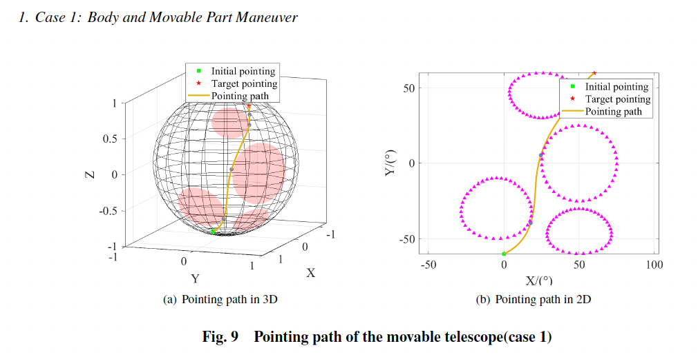
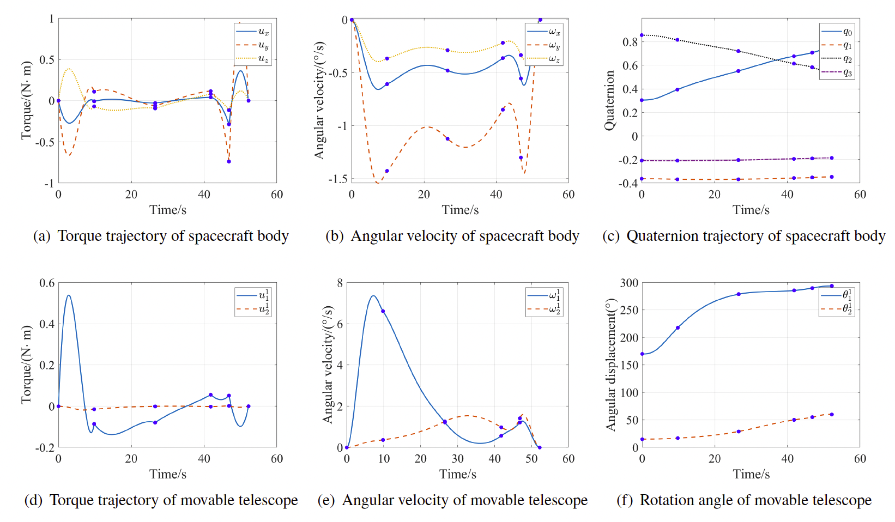
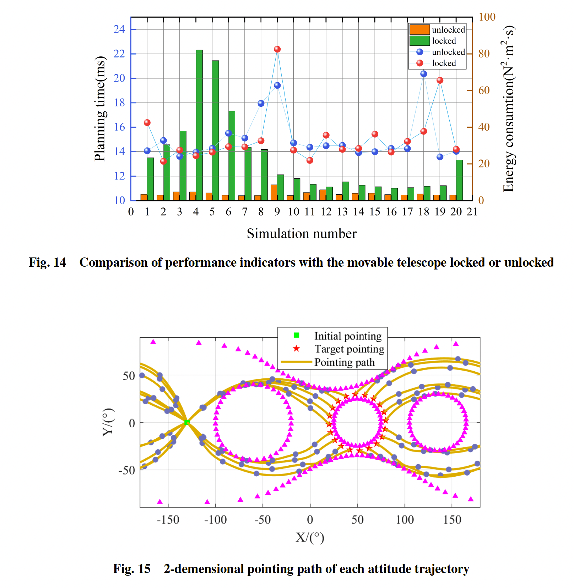

## Introduction

The problem of attitude planning for spacecraft with movable parts under complex pointing constraints is addressed in this paper. To avoid tackling the complex pointing constraints in the high dimensional system, a novel decoupled strategy is proposed to map the pointing space to attitude space. Path planning algorithm RRT*-Smart is employed in pointing space to generate a collision-free pointing path and piecewise quintic polynomials are used to represent the attitude path. By proving the differential flatness of spacecraft with movable parts, the inverse dynamics is used to acquire attitude state trajectory in state space. Benefiting from the decoupled strategy, the attitude state trajectory is optimized by a new heuristic time allocation algorithm using binary search with no gradient information needed. The simulation results are discussed, and the performance during each scenario is analyzed.

## Simulation Results

