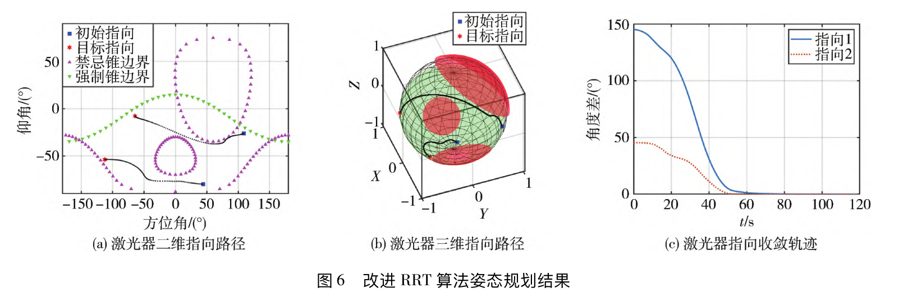
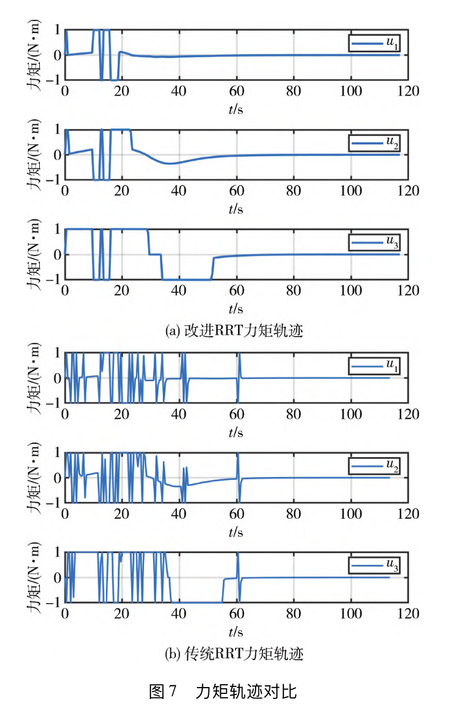

## 摘要

在引力波探测任务中，针对大尺度激光建链时目标姿态动态变化以及姿态机动约束复杂的问题，提出了引力波探测卫星动态姿态规划方法。首先给出引力波探测卫星的最优目标姿态求解方法。然后，设计了随机节点启发式扩展方法和目标姿态实时更新方法，对力矩轨迹进行平滑处理，实现了动态目标姿态规划。仿真结果表明，与经典RRT姿态规划方法相比，本文提出的方法具有更高的指向精度，并且消耗能量少，可满足引力波探测卫星大尺度建链保持的任务需求。

## 仿真结果

使用经典RRT算法和改进RRT算法进行姿态规划，仿真结果如下：

